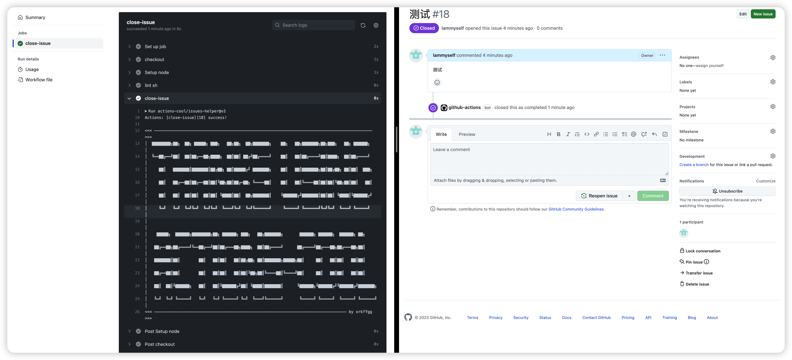

# 【web infra】github CI / CD 记录

使用**github Action**,第一步需要在项目根目录下创建`.github/workflows`文件夹;


然后可以根据我们的需要编写`.yml`文件来实现我们的需求:

## issues 相关

- 一、在 github 搜索**issues**相关的`action`:


看到搜索结果中:

1. **todo-to-issue-action**是将 github 中的评论转换为`issues`;
2. **actions/first-interaction**是筛选出贡献者第一次提`issue`,或者拉代码;
3. **lxerxa/actionview**一个问题追踪工具;

排除不合适的选项后, 其中[**actions-cool/issues-helper**](https://actions-cool.github.io/issues-helper-2.x/base#add-assignees)包含各种对**issue**操作, 是比较符合我们的需求的.

- 二、编写`.yml`文件

  - 检查**issues**格式是否规范, 并关闭不规范 issue:

  参考`github`[设置环境变量的教程](https://docs.github.com/zh/actions/using-workflows/workflow-commands-for-github-actions#setting-an-environment-variable)
  
  可以自己编写一个脚本来检查**issue**的格式:

  ```JavaScript
  // action_script/lintIssue.js
  const issueText = process.env.ISSUE;

  if(issueText.includes('问题描述')) {
    console.log('ISSUE_CHECK_RESULT=pass');
  } else {
    console.log('ISSUE_CHECK_RESULT=unqualified');
  }

  ```

  ```yml
  # .github/workflows/close-non_standard-issue.yml
  name: close non-standard issues

  on:
    issues:
      types: [opened, edited] # issue 打开或者编辑后

  jobs:
    close-issue:
      runs-on: ubuntu-latest
      env:
        ISSUE: ${{ github.event.issue.body }}
      steps:
        - name: "checkout"
          uses: actions/checkout@v3 # 拉取代码
        - name: Setup node
          uses: actions/setup-node@v3 # 安装node
          with:
            node-version: 18
            registry-url: https://registry.npmjs.com/
        - name: lint sh
          run: node ./action_script/lintIssue.js  >> "$GITHUB_ENV" # 将脚本输出的内容存入到环境变量中
        - name: "close-issue"
          if: ${{env.ISSUE_CHECK_RESULT == 'unqualified'}} # 如果Issue检查结果为不合格,就关闭Issue
          uses: actions-cool/issues-helper@v2
          with:
            actions: "close-issue"
            token: ${{ secrets.GITHUB_TOKEN }}
  ```

  第一次运行报错:
  

  报错无法访问,可以先去检查权限问题:
  

  再运行一次, 工作流执行成功, Issue 被关闭:
  
  如果是做一些简单的校验可以使用`actions-cool/issues-helper@v3`中的`check-issue`:

  ```yml
  name: add label of non_standard Issue

  on:
    issues:
      types: [opened, edited]

  jobs:
    check-issue:
      runs-on: ubuntu-latest
      steps:
        - id: check-issue # 必须使用id,不然不能访问到运行结果
          uses: actions-cool/issues-helper@v3
          with:
            actions: "check-issue"
            token: ${{ secrets.GITHUB_TOKEN }}
            issue-number: ${{ github.event.issue.number }}
            title-includes: "【,BUG,】" # 标题包含['【','BUG','】']
            body-includes: "问题描述,问题复现步骤" # 内容包含 ['问题描述','问题复现步骤']
        - name: add-label
          uses: actions-cool/issues-helper@v3
          if: ${{steps.check-issue.outputs.check-result == 'true'}} # 如果判断条件是 'true', 继续运行
          with:
            actions: "add-labels"
            token: ${{ secrets.GITHUB_TOKEN }}
            issue-number: ${{ github.event.issue.number }} # 当前Issue的编号
            labels: "bug" # 添加标签: 'bug'
  ```

  - 定期关闭不活跃的 **issues**:

    ```yml
    name: close inaction issue

    on:
      schedule:
        - cron: "8 12 * * *" # 每天 UTC时间中午12: 08(北京时间20: 08)

    jobs:
      check-need-info:
        runs-on: ubuntu-latest
        steps:
          - name: close-issues
            uses: actions-cool/issues-helper@v3
            with:
              actions: "close-issues"
              token: ${{ secrets.GITHUB_TOKEN }}
              labels: "need info"
              inactive-day: 3
    ```

## 使用 ftp 自动部署

在 github 中搜索`ftp action`, 第一个`SamKirkland/FTP-Deploy-Action`就是将 github 项目部署到`ftp`服务器的:


编写`yml`文件:

```yml
name: ftp send file

on: workflow_dispatch # 手动部署

jobs:
  web-deploy:
    name: Deploy
    runs-on: ubuntu-latest
    steps:
      - name: Get latest code
        uses: actions/checkout@v3 # 拉取项目代码
      - name: Setup node
        uses: actions/setup-node@v3 # 安装node
        with:
          node-version: 18
          registry-url: https://registry.npmjs.com/
      - name: install package
        run: npm i # 安装项目依赖
      - name: build
        run: npm run build # 编译
      - name: pack
        run: zip -q -r dist.zip ./dist # 打包成zip
      - name: Sync files
        uses: SamKirkland/FTP-Deploy-Action@v4.3.4 # 上传到ftp服务器
        with:
          server: 10.52.0.131 # 服务器地址
          username: testusername # 服务器用户名
          password: ${{ secrets.ftp_password }} # 服务器密码
```

服务器密码`secrets.ftp_password`,是在 github 中设置的秘钥:


